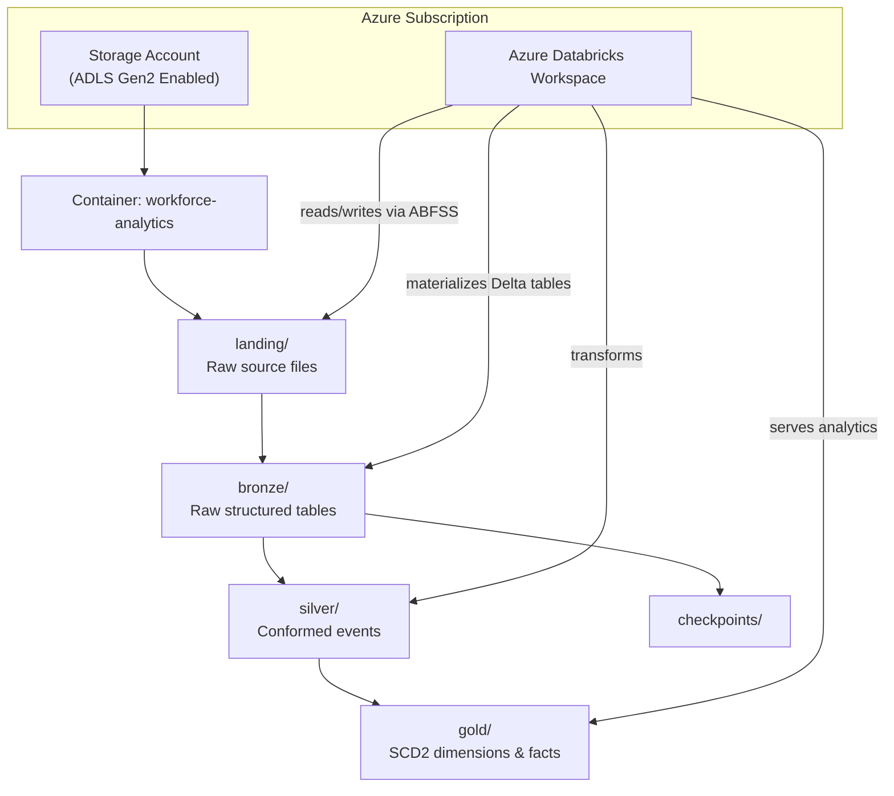
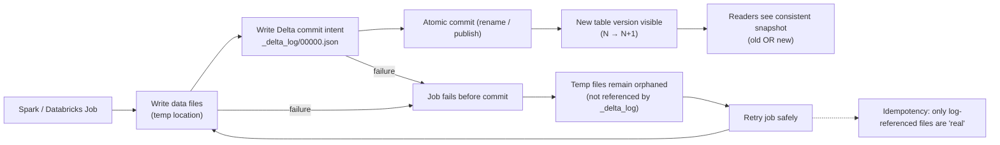

# azure-databricks-workforce-analytics

This repository demonstrates an Azure-native analytics engineering platform built with **Azure Databricks**, **Delta Lake**, and **SQL-first ELT patterns**.

The project transforms synthetic workforce data into governed, point-in-time analytics models using a layered **bronze / silver / gold** architecture.

---

## Architecture Overview

The implementation emphasizes pragmatic system design under real-world constraints:

- Incremental processing
- Dimensional modeling (SCD Type 2)
- Configuration-driven ingestion
- Deterministic SQL transformations
- Orchestration via Databricks Workflows
- Governed, point-in-time datasets

AI-assisted development is used internally for scaffolding and documentation acceleration.  
All pipelines remain deterministic, testable, and auditable.

---

## Storage Layer (ADLS Gen2)

**ADLS Gen2** is Azure Blob Storage with **hierarchical namespace enabled at the storage-account level**.

Enabling hierarchical namespace converts flat object storage into a true data lake by providing:

- Real directory structures
- POSIX-like ACLs
- Atomic rename and move operations
- Optimized performance for Spark and Databricks workloads

This capability is required for reliable Delta Lake pipelines.

---

## System Architecture



---

## Separation of Concerns

- **GitHub / Databricks Repos**  
  Code only: Python, SQL, notebooks, workflows, documentation

- **ADLS Gen2**  
  Data only: landing → bronze → silver → gold

- **Azure Databricks**  
  Execution engine: orchestration, transformation, validation

---

## Project Structure

```text
docs/                → Architecture & modeling documentation
ingestion/           → Config-driven ingestion framework
transformations/
    bronze/          → Raw structured tables
    silver/          → Conformed events
    gold/            → SCD2 dimensions & data quality checks
workflows/           → Databricks job definitions
```

---

## Design Philosophy

This project intentionally avoids unnecessary abstraction and focuses on:

- Transparent SQL logic  
- Clear lineage  
- Deterministic data transformations  
- Governance under constraint  
- Reproducible analytics engineering patterns  

The goal is not novelty — it is **durability and clarity**.

### Why Atomic Rename Matters

Modern analytics engines (Spark, Databricks, Delta Lake) publish datasets using a **write-then-rename** pattern:

1. Data is written to a temporary location
2. Once the write succeeds, the directory is **atomically renamed** into place

An **atomic rename** guarantees that a dataset becomes visible **all at once or not at all**.  
Readers will never observe partially written files or mixed versions of data.

This capability is critical for:
- Safe concurrent reads and writes
- Reliable job retries
- Correct checkpointing
- ACID-compliant Delta Lake transactions

Atomic rename is only guaranteed when using **ADLS Gen2 with hierarchical namespace enabled**.  
Flat blob storage does not provide this guarantee and can expose partial results, leading to silent data corruption.

---



---

**Failure/Retry behavior:** If a job fails before the atomic commit, any partially written data remains in a temp location and is **not referenced** by the Delta transaction log. Readers ignore it. A retry can safely re-run the write because only files referenced in `_delta_log` are considered part of the table. This is a key mechanism behind Delta’s durability and idempotent retry behavior.
