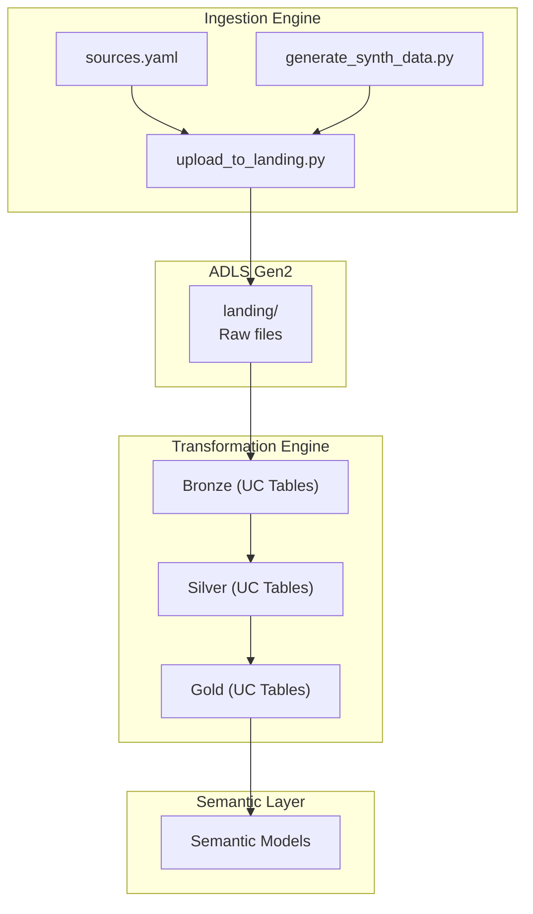

# Workforce Analytics — Domain Overview

This folder contains the complete implementation of the **Workforce Analytics domain**
within a modern, serverless Azure Databricks analytics platform. The domain is organized
into three clear layers:

- **Ingestion Engine** — Python-based, metadata-driven ingestion → ADLS landing  
- **Transformation Engine** — dbt + Serverless SQL Warehouse → UC Bronze/Silver/Gold  
- **Semantic Engine** (optional) — Genie semantic layer for AI/metric access  

This README explains:

- The domain folder structure  
- What each layer is responsible for  
- How data flows from raw files → curated UC tables  
- How this domain fits into the overall platform architecture  

---

## Domain Folder Structure

```text
workforce/
  ingestion_engine/          ← Python ingestion (YAML-driven → ADLS landing)
  transformation_engine/     ← dbt models (Bronze/Silver/Gold in UC)
  semantic_engine/           ← Optional Genie semantic layer
  docs/                      ← Human documentation (optional)
  README.md                  ← You are here
```

---

# Ingestion Engine (Python → ADLS Landing)

The ingestion engine is responsible for **landing raw data** in ADLS Gen2.  
It does **not** create Delta tables, does **not** require Spark, and does **not** use clusters.

### Responsibilities
- Generate synthetic data (optional)
- Read YAML metadata (`sources.yaml`)
- Upload raw files to ADLS landing
- Preserve folder structure and naming conventions
- Remain cost-efficient and Databricks‑optional

### Output
```
abfss://.../workforce/landing/<source_name>/...
```

This is the **only output** of ingestion.

---

# Transformation Engine (dbt + Serverless SQL Warehouse → Unity Catalog)

All medallion modeling is performed using **dbt** running on **Serverless SQL Warehouse**.

### Responsibilities
- Read raw files from ADLS landing
- Create **Bronze** tables in Unity Catalog
- Apply typing, deduplication, and incremental logic (**Silver**)
- Build dimensional models and facts (**Gold**)
- Enforce governance through Unity Catalog

### Output
All curated tables live in UC:

```
catalog.schema.bronze_<table>
catalog.schema.silver_<table>
catalog.schema.gold_<table>
```

No Bronze/Silver/Gold folders exist in ADLS.

---

# Semantic Engine (Optional)

If enabled, the semantic engine provides:

- Genie semantic definitions  
- Metric layers  
- Business-friendly access to curated UC tables  

This layer is optional but recommended for AI/BI consumption.

---

# Data Flow Diagram (Modern Architecture)



---

# Separation of Concerns

- **Ingestion Engine** → Raw data only  
- **Transformation Engine** → All SQL modeling  
- **Semantic Engine** → Business/AI layer  
- **Unity Catalog** → Governance + table storage  
- **Serverless SQL Warehouse** → Compute  

This separation ensures clarity, modularity, and cost efficiency.

---

# How to Run This Domain

### 1. Run ingestion (Python, via Databricks notebook or locally)
- (Optional) Generate synthetic data into a local/temp folder (e.g., `/tmp/workforce_synth`).
- Use `upload_to_landing.py` (directly or via `run_ingestion`) to push files into ADLS landing:
  - `abfss://.../workforce/landing/...`
- Validate that landing paths and file structures match `sources.yaml`.

### 2. Run dbt models (Serverless SQL Warehouse → Unity Catalog)
- Point dbt at your Databricks Serverless SQL Warehouse.
- Run `dbt run` to materialize Bronze → Silver → Gold tables in Unity Catalog.
- Run `dbt test` to execute schema and data tests.
- (Optional) Run `dbt docs generate` to build documentation.

### 3. (Optional) Enable semantic layer
- Configure Genie (or equivalent) semantic definitions over UC Gold tables.
- Expose curated metrics and dimensions to BI/AI consumers.

---

# Design Philosophy

This domain is built around a modern, cloud‑native analytics architecture that
emphasizes clarity, governance, and long‑term maintainability. Each layer has a
single responsibility, and the system avoids unnecessary infrastructure,
complexity, or cost.

Core principles:

- **Thin, metadata‑driven ingestion**  
  Ingestion is lightweight and deterministic, producing only raw files in ADLS
  based on declarative YAML configuration.

- **Serverless, SQL‑first transformations**  
  All modeling is performed in dbt using Databricks Serverless SQL Warehouse,
  ensuring predictable performance and pay‑per‑second efficiency.

- **Unity Catalog as the system of record**  
  All curated tables—Bronze, Silver, and Gold—are governed, discoverable, and
  lineage‑tracked within Unity Catalog.

- **Declarative, testable modeling with dbt**  
  Transformations are version‑controlled, documented, and validated through dbt
  tests, exposures, and incremental logic.

- **Clear separation of concerns**  
  Ingestion handles raw data movement; transformations handle modeling; the
  semantic layer (optional) exposes business‑friendly metrics and definitions.

- **Cost‑efficient, scalable architecture**  
  No clusters, no idle compute, no unnecessary infrastructure. Everything is
  serverless, modular, and designed to scale cleanly across domains.

The goal is **clarity, durability, and correctness**—a platform that is easy to
reason about, easy to extend, and easy to trust.

