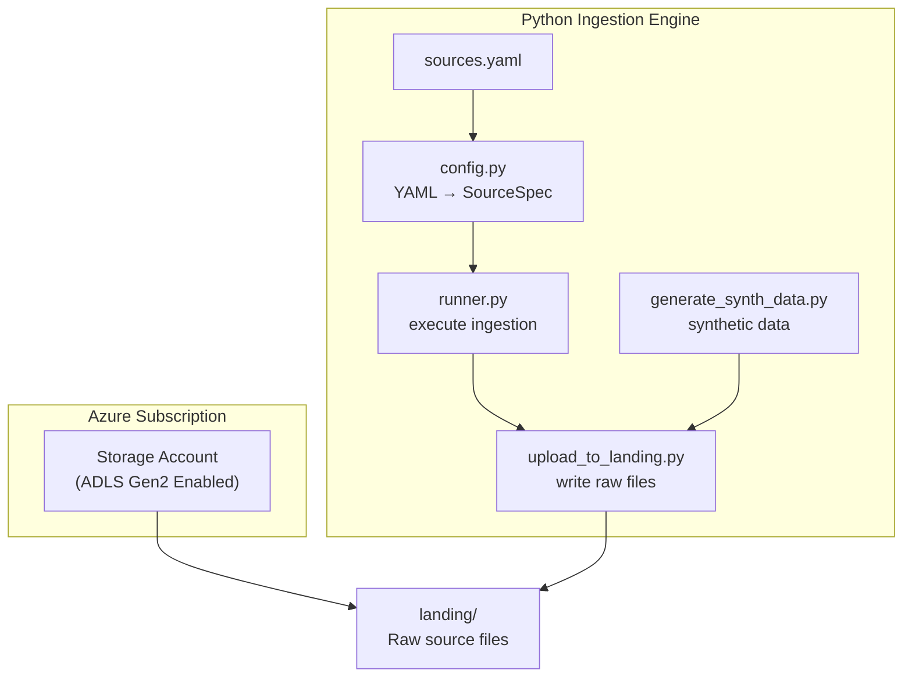

# Workforce Analytics — Ingestion Engine

This folder contains the **Python‑based, metadata‑driven ingestion engine** for the Workforce Analytics domain.  
It is responsible for generating or receiving raw data and landing it in **ADLS Gen2** in a clean, deterministic, and governed manner.

This ingestion engine is **independent of Databricks compute**.  
It does **not** create Bronze/Silver/Gold tables and does **not** require clusters or SQL Warehouses.

It explains:

- What ingestion documents exist  
- Which files are used at runtime  
- How YAML‑driven ingestion works  
- How data flows into ADLS landing  
- Why ADLS Gen2 matters for downstream modeling  

---

## Ingestion Folder Structure

```text
workforce/
  ingestion_engine/
    sources.yaml                ← Runtime metadata input
    scripts/
      config.py                 ← Loads YAML → SourceSpec
      runner.py                 ← Executes ingestion for each source
      upload_to_landing.py      ← Uploads raw files to ADLS landing
      generate_synth_data.py    ← Synthetic data generator
    notebooks/
      run_full_ingestion.py     ← Optional Databricks orchestrator notebook
    README.md                   ← You are here
  docs/                         ← Human documentation (optional)
```

---

## What Documents Are Actually Used at Runtime

| Document | Used By | Purpose |
|---------|---------|---------|
| `sources.yaml` | Python ingestion | Defines landing paths, formats, and keys |
| `scripts/config.py` | Python ingestion | Converts YAML → typed `SourceSpec` objects |
| `scripts/runner.py` | Python ingestion or Databricks notebook | Executes ingestion for each source |
| `scripts/upload_to_landing.py` | Python ingestion | Uploads raw files to ADLS landing |
| `scripts/generate_synth_data.py` | Python ingestion | Generates synthetic CSVs |

Everything else is scaffolding.

---

## Detailed Ingestion Flow

### Metadata Loading

```
sources.yaml
   └── defines:
         - format
         - landing_relpath
         - keys
```

### Python Ingestion Layer

```
config.py
   └── load_sources_yaml()
         └── creates dict[str, SourceSpec]

runner.py
   └── for each source in SOURCES:
         └── uploads or generates raw files into ADLS landing
```

This ingestion engine **does not** create Delta tables or medallion layers.  
It is strictly responsible for **landing raw data**.

---

## Storage Architecture (ADLS Gen2)

The ingestion engine writes raw files into **ADLS Gen2** with hierarchical namespace enabled.

This provides:

- Real directory structures  
- POSIX‑like ACLs  
- Atomic rename operations  
- Optimized performance for downstream engines (dbt, SQL Warehouse, Spark)  

ADLS Gen2 is the **source of truth** for all downstream modeling.

---

## System Architecture Diagram (Ingestion‑Only)



---

## Separation of Concerns

- **GitHub** → Code only  
- **ADLS Gen2** → Raw data landing  
- **dbt + SQL Warehouse (separate folder)** → Bronze/Silver/Gold modeling  
- **Genie (separate folder)** → Semantic layer  

This ingestion engine is intentionally **decoupled** from modeling and compute.

---

## How to Run This Ingestion Engine

### Prerequisites

- Python 3.x  
- Azure CLI (for authentication)  
- ADLS Gen2 storage account  
- Service principal or user identity with RBAC + ACL permissions  

### Steps

1. Authenticate to Azure (`az login` or service principal)  
2. Update `sources.yaml` with landing paths  
3. Run `generate_synth_data.py` (optional)  
4. Run `runner.py` to land raw files in ADLS  

All ingestion steps are deterministic and idempotent.

---

## Design Philosophy

This ingestion engine prioritizes:

- Metadata‑driven configuration  
- Deterministic ingestion  
- Clear separation from modeling  
- Identity‑native cloud access  
- Low cost and zero idle compute  

The goal is **clarity, durability, and correctness**, not novelty.
